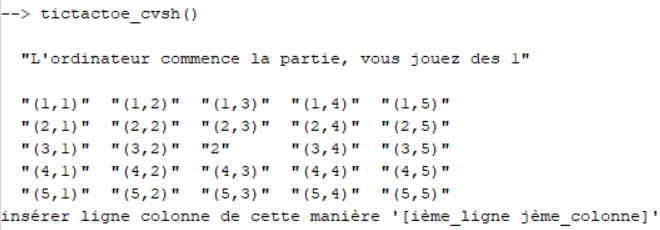

 </a>

<h3 align="center">My first project: tic-tac-toe</h3>

  
  

---

💡 In 2018, I have created an infinite tic-tac-toe interactive game in scilab

## Why I made this project? 

- During a class on introduction to computer sciences for teachers, we had as a project to implement a game. Unfortunately, at this point of my studies, I didn't know  IA. So the mechanics of your opponent are hardcoded and basic.

## How to play

**Rules of the game:**

- Two players play against each other, they take turns and the first one to align 3 of his "pawns" (up-down, left-right, vertical) wins. When a square is chosen, it must be empty (i.e. not yet played) and must be connected to the game, i.e. touching a "piece" on one of its direct or diagonal sides.

**Notation:**
- c : computer player with a given logic
- r : computer player playing randomly
- h : human, you
- So, the function tictactoe_cvsh.sce means that the computer with a given logic is playing against us.

**How to play:**

- Download all the files and execute them on scipy.
- Then, execute one of the gaming function, tictactoe_cvsh.sce for example: `tictactoe_cvsh()` in the console and press Enter.

- Then if you want to play on the left of your opponent, insert `[3 2]` and press Enter. And so on.

## Built With

- Scipy

## Author

**Julien Python**

- [Profile](https://github.com/pythonjul "Julien Python")
- [Email](mailto:pythonjul@gmail.com?subject=Hello "Hello!")
